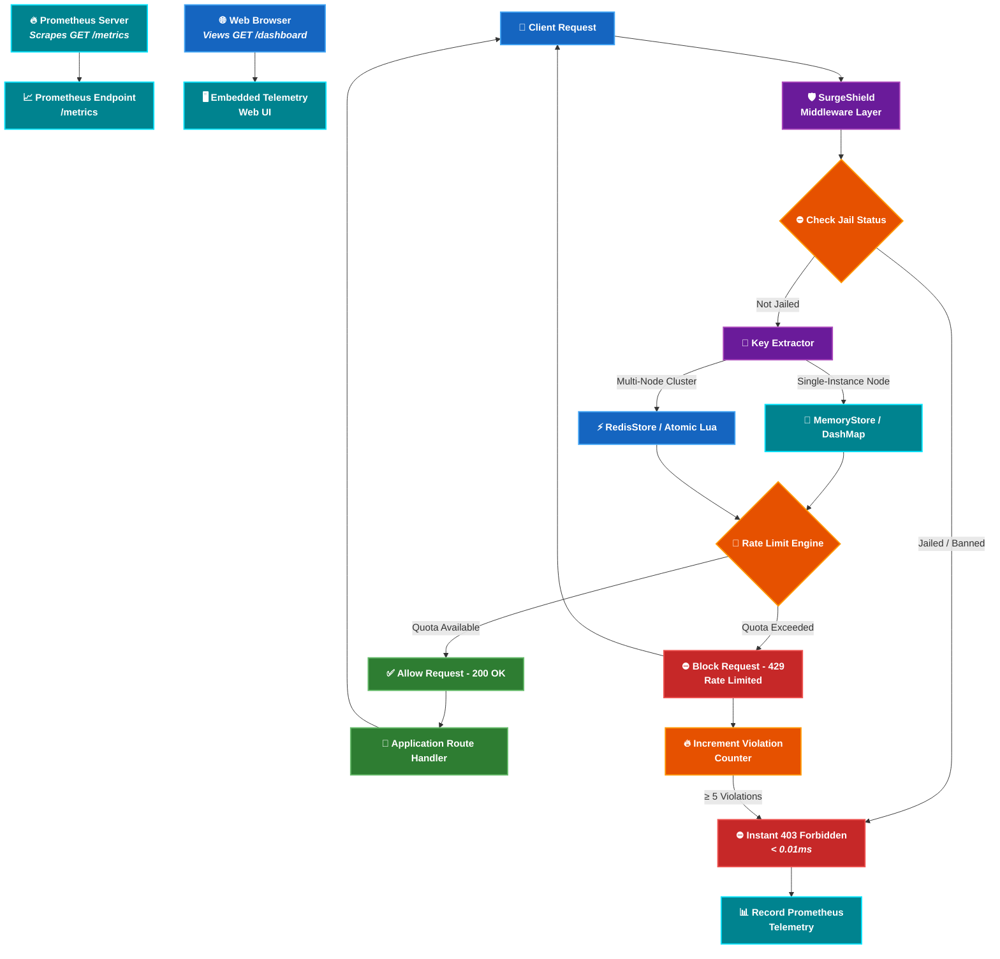

<h1 style="margin:0;">
  
  Developer Portfolio — Arpan Biswas
</h1>

<h2 style="margin:0;">
  
  Preview
</h2>

<p align="center">
  
</p>

🌐 **Live Website:** https://portfoliox-tauv.vercel.app


<h2 style="margin:0;">
  
  Overview
</h2>

This portfolio represents my journey as a **B.Tech CSE (AI-ML)** student, focused on building scalable, efficient, and user-centric applications. It combines modern UI/UX design with smooth animations and interactive elements to create an engaging experience.


<h2 style="margin:0;">
  
  Features
</h2>

- ⚡ **Modern Futuristic UI** — Clean, dark-themed interface with glowing cosmic accents  
- 🌌 **3D Interactive Space Canvas** — Real J2000 planetary orbital physics with interactive camera tilt  
- 🎬 **Smooth Animations & 60 FPS Performance** — Powered by Framer Motion & GPU hardware acceleration  
- 📊 **Live GitHub Activity Graph** — Real 52-week contribution heatmap synced via GitHub APIs  
- 🧠 **AI & Distributed Systems Projects Showcase** — Highlighting projects like SurgeShield (lock-free rate limiter in Rust)  
- 📱 **Fully Responsive Design** — Optimized for mobile, tablet, and desktop viewports  
- 🚀 **Production-Ready CI/CD Workflows** — Automated daily stats sync & Vercel deployment  


<h2 style="margin:0;">
  
  Tech Stack
</h2>

### 🚀 Frontend
- **Next.js 16 (App Router & Turbopack)**
- **React**
- **TypeScript**

### 🎨 Styling & Design
- **Tailwind CSS**
- **Vanilla CSS Tokens & Glassmorphism**

### 🎬 Animations & 3D Physics
- **Framer Motion**
- **HTML5 Canvas 2D Celestial Physics Engine**

### ⚙️ Automation & Tooling
- **GitHub Actions (CI/CD Workflows)**
- **Node.js Automation Scripts**

### ☁️ Deployment
- **Vercel**


<h2 style="margin:0;">
  
  System Architecture
</h2>




<h2 style="margin:0;">
  
  Automated Workflows & CI/CD
</h2>

### 🤖 GitHub Coding Stats Sync Workflow
- **Workflow File:** [.github/workflows/update-coding-stats.yml](.github/workflows/update-coding-stats.yml)
- **Automatic Triggers:**
  - `push: branches: [main]` — Runs automatically whenever code is pushed to the `main` branch.
  - `schedule: cron '0 0 * * *'` — Runs automatically every day at midnight UTC (5:30 AM IST).
  - `workflow_dispatch` — Allows manual one-click trigger from the GitHub Actions tab.
- **Automation Pipeline:**
  1. Executes [scripts/fetch-github-stats.mjs](scripts/fetch-github-stats.mjs).
  2. Queries live GitHub APIs for repository language breakdown and real 52-week contribution calendars.
  3. Updates [public/data/coding-stats.json](public/data/coding-stats.json).
  4. Automatically commits changes back using `git-auto-commit-action`.

### 🚀 Continuous Deployment
- Integrated with **Vercel** for instant production builds and zero-downtime deployment on every commit.


<h2 style="margin:0;">
  
  Folder Structure
</h2>

```
PORTFOLIO/
├── .github/
│   └── workflows/
│       └── update-coding-stats.yml   # GitHub Action automated workflow
├── app/                              # Next.js App Router pages and layout
├── components/                       # Reusable UI components & 3D visuals
│   └── ui/                           # UI primitives (OrbitalHero, StarButton)
├── public/                           # Static assets & live JSON stats
│   └── data/
│       └── coding-stats.json         # Automated GitHub contribution dataset
├── scripts/
│   └── fetch-github-stats.mjs        # Automation script fetching live API metrics
├── utils/                            # Helper utilities and motion variants
├── README.md
├── next.config.ts                    # Next.js configuration
├── package.json                      # Dependencies and scripts
└── tsconfig.json                     # TypeScript configuration
```

<h2 align="left">
  
  &nbsp;<b>Getting Started</b>
</h2>

### 📥 Clone the Repository
```bash
git clone https://github.com/8ernity/PORTFOLIO.git  
cd PORTFOLIO  
```


<h3 style="margin:0;">
  
  Install Dependencies
</h3>

```bash
npm install  
```

### 💻 Run Development Server
```bash
npm run dev  
```
Open in browser: `http://localhost:3000`

### 📊 Fetch Live Stats Manually
```bash
node scripts/fetch-github-stats.mjs
```

### 🏗 Build for Production
```bash
npm run build  
```

### ▶️ Start Production Server
```bash
npm start  
```


<h2 style="margin:0;">
  
  Contributing
</h2>

Contributions, suggestions, and feedback are welcome!  
Feel free to fork the repository and submit a pull request.

<h2 style="margin:0;">
  
  Support
</h2>

If you like this project, consider giving it a ⭐ on GitHub!


### 📜 License

This project is open-source and available under the MIT License.
